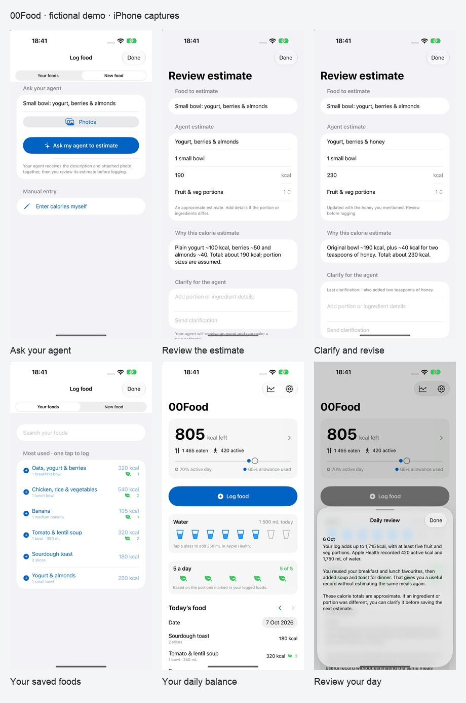

# iPhone screenshots

Actual iPhone 18 Pro Max simulator captures, 1320 × 2868, RGB JPEG with no alpha.
The App Store Connect display type is `APP_IPHONE_67`. The order in
[manifest.json](manifest.json) introduces the agent companion, then shows the
food workflow and Health context, followed by setup instructions.

Six screens use entirely fictional foods, Health values and authored sample
agent replies. They contain no customer data and did not contact a real agent.
The [local demo](../../../ios/ScreenshotDemo/README.md) has a separate bundle ID,
blocks service and Health access, and is excluded from the shipping app. Its
fixed clock is October 7, 2026, 18:41 UTC. Estimates remain outside the logged
total until approved.

| Screenshot | Story |
| --- | --- |
| [Welcome](iphone-agent-sign-in.jpg) | Your food log. Your AI agent. |
| [Ask your agent](iphone-ask-agent.jpg) | Describe a new food; manual entry remains available. |
| [Review estimate](iphone-agent-estimate.jpg) | A fictional 190 kcal yogurt bowl and the agent's assumptions. |
| [Clarification](iphone-agent-clarification.jpg) | Two teaspoons of honey revise the estimate to 230 kcal. |
| [Your foods](iphone-personal-library.jpg) | Six personal favourites saved from prior estimates. |
| [Daily balance](iphone-daily-balance.jpg) | 1,465 kcal eaten, 420 active, 805 remaining, water and five a day. |
| [Daily review](iphone-daily-review.jpg) | A fictional review of yesterday's 1,715 kcal log. |
| [Agent setup](iphone-agent-setup.jpg) | Bring your own agent; ChatGPT Work setup. |
| [MCP Events](iphone-agent-events.jpg) | Instructions and event subscriptions. |

00Food targets iPhone only; no iPad screenshot set is maintained. Store text is
maintained in [app-store.json](../app-store.json). Preview images are for review,
not an App Store upload.
